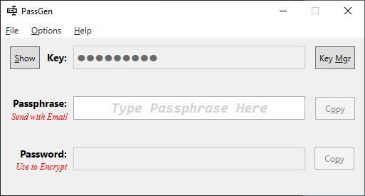

# PassGen

PassGen is tool that is used for generating passwords. Passwords are generated using a combination of a pre-shared secret key, and a shared passphrase.

## Concept
PassGen is intended to generate passwords to be used for symmetric encryption, and provide safe means to communicate the password between parties.
### Here is a typical usage scenario:

Multiple parties need to exchange information securely via encrypted email attachments.

<i>Key Establishment</i>
<ol>
    <li/> The parties share a pre-shared key <b><i>[SuperSecretK3y!]</i></b> via private channel (i.e. SMS text, phone call).
    <li/> The pre-shared key is loaded into all parties PassGen tool.
</ol>
<i>Sender</i>
<ol>
    <li/> The sender chooses a Passphrase <b><i>[Peanut Butter and Jelly]</i></b> to generate a password.
    <li/> The generated password is used to encrypt a file (i.e. Encrypted ZIP archive).
    <li/> The sender attaches the encrypted attachment to an email, they include the Passphrase they used, and send the email.
</ol>
<i>Recipient(s)</i>
<ol>
    <li/> The recipient(s) enter the Passphrase <b><i>[Peanut Butter and Jelly]</i></b> into PassGen.
    <li/> The generated password is used to decrypt the email attachment.
</ol>

## Features

### PassGen is under development, but several features have been prototyped in another project which will be included.
<ol>
    <li/> Key Archive
    <ul>
        <li/> Stores multiple keys organized by date
        <li/> Secure key storage in User Profile registry
        <li/> Password protected Key Archive export and import functionality
    </ul>
    <li/> Intuitive UI and Automation
    <ul>
        <li/> Common UI control interactions
        <ul>
            <li/> Keyboard and Mouse operation of familiar controls
            <li/> Keyboard shortcuts
            <li/> Context menus
        </ul>
        <li/> Clipboard automation
        <ul>
            <li/> Automatic copying of generated passwords
            <li/> Copy buttons for passphrase and generated password
            <li/> Automatic, time delayed purging of clipboard contents
        </ul>
    </ul>
    <li/> Execution Features
    <ul>
        <li/> Automatic launch at Startup [Login]
        <li/> Close [Minimize] to Notification Tray
    </ul>
</ol>

### Future Planned Features
<ul>
    <li/> 7-zip Integration
    <ul>
        <li/> Ability to automatically create encrypted ZIP files and embed passphrase
        <li/> Ability to automatically decrypt ZIP files using embedded passphrase <i>(if the Key & Passpharase pair is correct)</i>
    </ul>
</ul>

## Development Log - To-Do
Listed in no particular priority: Autostart, Import / Export, Singleton / Mutex, Code Cleanup, Commandline Arguments Prep & Design, 7-zip integration
